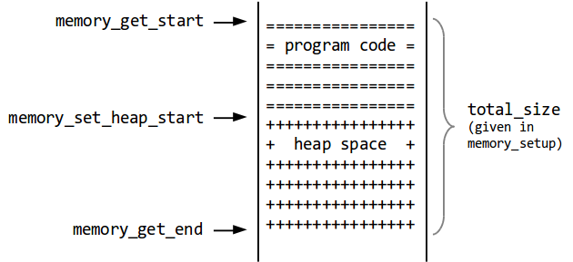
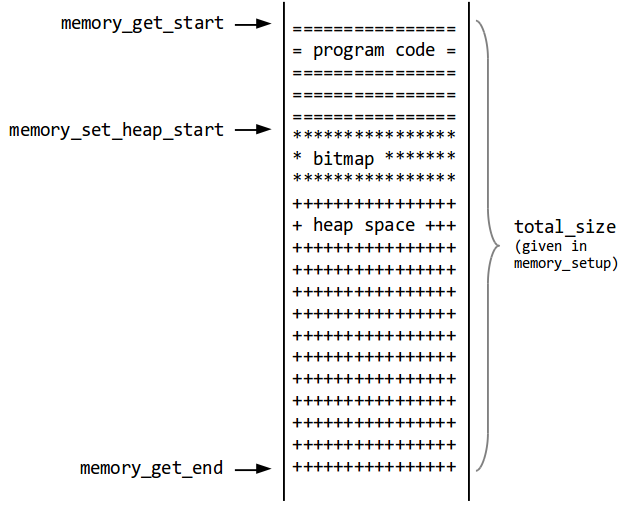

> Due 11:59pm Sunday Apr 21 (two weeks project)

Download the skeleton code for the project
[here](https://www.cs.purdue.edu/homes/gao606/cs352/proj7.zip){:target="_blank"}.

## Introduction

### ASM Lowering and Virtual Machine

The skeleton code you are given for this assignment contains two
elements:

-   The compiler, with reference implementations of the phases so far
    (but no Optimizer), a CPS register allocator and a CPS to assembly
    language transformer in
    `compiler/src/miniscala/CPSToASMTranslator.scala`;
-   A virtual machine for executing the assembly code, in the `vm` directory.

The virtual machine contains two main components:

-   The interpreter, located in `vm/src/engine.c` (and with the
    header file `vm/src/engine.h`);
-   The memory system, implemented in `vm/src/memory_nofree.c` and
    `vm/src/memory_mark_n_sweep.c` (and with the header file
    `vm/src/memory.h`).

The virtual machine also contains basic infrastructure like a makefile
and 4 tests you can use to check your GC implementation.

### Getting Started

To start, unpack the skeleton code as you have done for the last
assignments. Now, you will have the `vm` directory. Go there and
run `make`:

    $ cd vm/
    $ make
    Use the following targets:
     - 'make vm' to use your mark-sweep GC
     - 'make test' to test the VM
     - 'make clean' to clean the VM
    $ make test
    rm -rf bin
    mkdir -p bin
    cc -std=c99 -g -Wall -O3  src/engine.c src/fail.c src/loader.c src/main.c src/memory.c -o bin/vm
    Queens test failed!
    Bignums test failed!
    Pascal test failed!
    Maze test failed!

You can also run the tests individually, since they're included in
`examples`:

    $ bin/vm ../examples/asm/queens.asm
    enter size (0 to exit)> 10
    Error: no memory left (block of size 2 requested)

Your task is simple: make the tests pass by implementing a mark and
sweep garbage collector instead of the no-GC memory system currently
implemented in `vm/src/memory_nofree.c`. In order to test the vm
with your garbage collector, you will need to change the value of the
variable `GC_VERSION` in the file `memory.h`.

Okay, that's it with the intro. Now for real work.

## The Memory

We first breifly describe how the VM engine interacts with the memory
manager and subsequently detail the implementation that is required for
this assignement.  When the virtual machine is started, the first call
is to `memory_setup`.  This allows the memory manager to allocate the
total memory (the amount can be changed using the `-m <size>` command
line option of the vm). The "total_size" parameter passed to this
method indicates the total number of **bytes** needed (the default value
is 1000000). The method `memory_get_start` returns a pointer to the
beginning of this allocated memory. The total memory is used to store
the program code and the heap.

The virtual machine then loads the program code into the memory.
Afterwards, the method `memory_set_heap_start` is called, indicating the
first address that directly follows the program code. The memory
starting from this address can be used by the memory manager to store
its data structures and for allocating blocks in the heap: 

{:width="400"
height="183"}

The function `memory_allocate` is invoked when a heap block needs to be
allocated.

### Virtual and Physical Addresses

-   The memory can be seen as an array of 32-bit values referred to as
    **words**, which is represented by the type `value_t` in the VM.
    Every entry in the array can contain arbitrary 32 bit information:
    tagged values, virtual addresses (explained below), block headers or
    registers (which are also stored in the heap)
-   There are two kinds of addresses in the VM:
    -   Physical addresses, represented as values of type `value_t*`,
        are pointers to the elements of the memory array.
    -   Virtual addresses, represented as values of type `value_t`, are
        relative to the starting (physical) address of the memory and
        only point to individual **words**, so their last two bits are
        always 0. This satisfies the tagging requirement for references,
        which states that they should end in bits 00;
-   The pointers stored in the heap are always virtual addresses. The
    `addr_v_to_p `and `addr_p_to_v` methods in the file `engine.c`
    convert between the two address types.
-   While physical addresses are addresses of words in the memory,
    virtual addresses are virtual machine pointers. **It is essential
    that addresses stored in the heap are virtual addresses and not
    physical addresses (i.e, pointers to the elements of the memory
    array)!**
-   For efficiency reasons, the pointers stored in the base registers
    (result of `engine_get_base_register`) are physical addresses.
-   The **size** parameter passed to the `memory_allocate` function is
    numbers of **words** that have to be allocated.

## The Garbage Collector

You are required to write a memory manager that implements the
interfaces defined in the "memory.h" file and performs mark-sweep
garbage collection. Below we provide an overview of the data structures
that have to be implemented and also a few tips and tricks.

#### Block Headers

As discussed in the lectures, memory is allocated and freed in chucks of
words referred to as blocks. Each block has a tag and a size which are
passed as parameters to the "block-alloc" primitive. We refer to the
starting address of a block as a "block pointer". Use the first word
of a block to store the tag and size of the block (which are referred to
as block headers). Therefore, to allocate a block of size n you will
need n+1 words.

#### Free list

You GC must have a (singly-linked) free list containing all the free
blocks. The second word of a free block can be used to store the address
of the next element of the free list.

There is a slight trick with free lists. A free list entry contains at
least 2 words. But the library allocates blocks of size 0 (and thus 1
word) that your GC can later free. This produces 1-word entries in the
free list, which won't work. To overcome this, the easiest solution is
to allocated at least two words, even for blocks of size 0.

The free list is used to allocate blocks. When having multiple free list
entries, you should either pick the smallest one that fits the necessary
size (best fit strategy) or the first one that fits (first fit
strategy).

#### Segregated free lists

Instead of having a single free list, it is much more efficient to have
several free lists, one per block size up to a maximum block size, plus
one free list for the bigger blocks. That way, in many cases, no
iteration is necessary to find a free block of a given size.

We suggest you write a first version of your GC with a single free list,
and once it works, you update it to have 32 segregated free lists. As
described below, only a GC using segregated free lists could get you the
maximum number of points for this assignment.

#### Pointer Bitmap

You need to maintain a bitmap with one bit per valid heap address. This
bitmap is used for two purposes:

1. to determine if a value stored in the heap is a valid block
pointer. Even though we use tagged values, it is possible that, during
an arithmetic operation, an untagged value is left in one of the
registers. Since the registers of our virtual machine are also stored in
the heap, we may mistake an untagged value for a virtual address in the
marking phase. So although it looks like a virtual address, the untagged
value may point anywhere, including invalid locations and in the middle
of blocks. In order to prevent the GC from following incorrect
addresses, we mark the beginning of each block in the bitmap.

2. during marking, we reset the bit to mark a block; therefore, at
the end of the marking phase, the marked blocks will be those whose bit
is not set in the bitmap. During the sweeping phase, you will also have
to coalesce successive entries in the free list, so the heap memory does
not get too fragmented. Also don't forget to update the bitmap so that
allocated blocks have their bit set, and free blocks have their bit
cleared.

To complete the above picture, the memory layout would actually look
like this:

{:width="400"
height="323"}

## Testing

You can either use the `make test` command to execute the tests
automatically, or you can run each individual test by hand (good for
debugging):

    $ bin/vm ../examples/asm/queens.asm
    enter size (0 to exit)> 10
    Error: no memory left (block of size 16 requested)

The expected sizes your program should run on are:

-   for queens.asm: without GC - breaks at 8, GC works with 15
-   for bignums.asm: without GC - breaks at 214, GC works with 1000
-   for pascal.asm: without GC - breaks at 57, GC works with 200
-   for maze.asm: without GC - breaks at 7, GC works with 20

The test given to you do not check for the correctness of the output, it
only check that the program run without Out Of Memory errors.

If you want to test simpler program, you can compile them with the
compiler first: `sbt "run file.scala"`. It will generate the file
out.asm in the compiler folder. You can then run the vm on it.

## Debugging

When debugging you may want to trigger a garbage collection early on. To
do so, print the code size and adjust the memory with
`bin/vm -m <bytes>` such that the size is just above the code size +
twice the bitmap size. This will let you trigger the garbage collection
early, when the program hasn't yet allocated too much space, allowing
easier debugging.

**Implement a procedure to check the data strcuture invariants**

For ease of debugging, it is recommended that you implement a procedure
that traverses every block in the heap and checks for the correctness of
the headers and the freelist. To traverse all blocks in the heap you can
start from the first block and use the block size (stored in the header)
to jump to the start of the next block and so on. Also, use "assert"s
(defined in assert.h header file) in all places in the code where you
think an invariant must hold. This will greatly help in debugging. Of
couse, this is only recommended and not mandatory.

**The assignment will be evaluated based on the correctness of the
implementation, its memory efficiency and execution time.**

## Grading

Here are several points to keep in mind:

-   You **are not allowed to use malloc** within the vm. The heap has
    been allocated once, and all GC data structure needed must used this
    pre-allocated space.
-   If your GC has a single free list, you will be able to get 100% of
    the points; to get to 120%, you need to have segregated free lists;
    however, don't forget that a working GC with a single free list is
    better than a crashing one with segregated free lists!
-   Neither of the examples should take more than 1s to run (best
    running times are in the order of hundreds of miliseconds)
-   We may test your assignment through **valgrind** or address
    sanitizer, so you should be very careful about the way you allocate,
    access and free memory (you **~~can~~ should** also run your
    assignment through valgrind/with address sanitizer on your own)
-   We will use the reference Makefile to compile and test your GC:
    please make sure that "make test" runs correctly on your machine
    and if there are additional flags necessary, remind us in the
    "memory_mark_n_sweep.c" file.
-   We encourage you to write code that compiles across platforms. This
    includes avoiding any cast from a pointer X* to a value or integer
    type (value_t, int, long int, unit, size_t ...). It is safe to cast
    form one pointer type to another (X* to Y*, such as from (void*)
    to (char*) or (value_t*)).

These criteria can influence your grade, so please take them into
account!

<mark>You should write 5 meaningful tests.
These 5 tests will be worth 5% of your grade. For extra credit you may
write up to an additional 5 tests, worth 1% bonus each. Please name your
test files test1.scala, test2.scala, ... and place them in the examples
folder.</mark>

## Turnin

You should turn in the **proj7** directory. Please run an 'sbt clean'
and './cleanall.sh' before submitting.

To turn in your project create a ZIP file named
`<purdueemailusername>-proj<N>.zip` of the `proj7` directory for
example `axhebraj-proj7.zip` and upload it to the corresponding
assignment on Brightspace.
